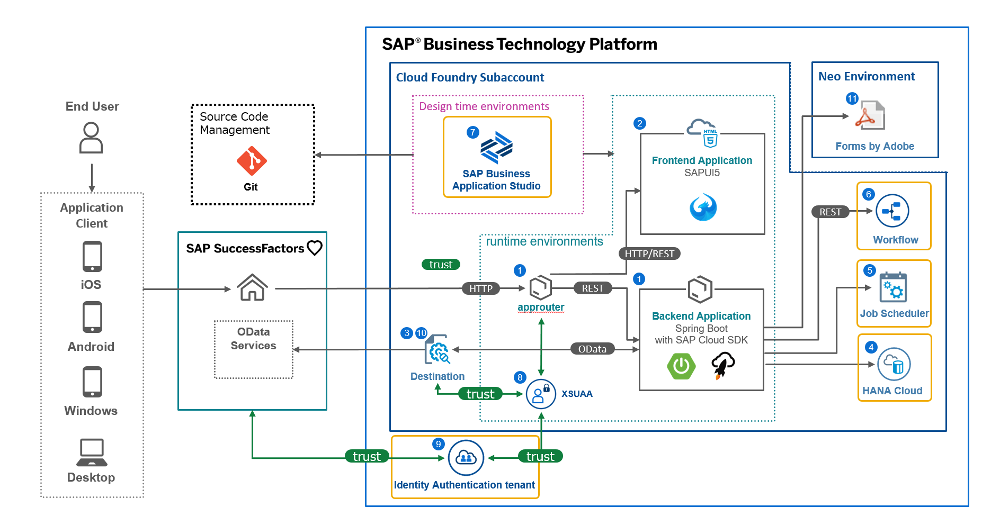

# SAP SuccessFactors Extension on BTP for Japan

## Description

The **SAP SuccessFactors Extension on BTP for Japan** project contains a collection of full-stack SuccessFactors extension apps that demonstrate the implementation of a Cloud Foundry application built with **SAPUI5** and **Cloud SDK (Java)**. This is in the context of extending the Japanese-specific process "Tamatsuki-Jinji" in SAP SuccessFactors.

### Note

Read [here](./README_JP.md) if you want to get a doc written in Japanese.

## List of projects

| Application             | Scenario Description                                         |
| ----------------------- | ------------------------------------------------------------ |
| Reshuffle_Applicants    | UI5 and Java app to create a "Tamatsuki-Jinji" plan          |
| Reshuffle_Simulation    | UI5 and Java app to confirm a consistency of created plan    |
| Reshuffle_Configuration | UI5 and Java app to configure properties of **Reshuffle_Applicants** and **Reshuffle_Simulation**. |
| Reshuffle_DB            | HANA DB module for **Reshuffle_Applicants**, **Reshuffle_Simulation**, **Reshuffle_Configuration** |

## Solution Diagram

### Diagram

### Service List

| **No.** | **Service Name**                            |
| ------- | ------------------------------------------- |
| 1       | Cloud Foundry Runtime                       |
| 2       | HTML5 Application Repository  Service       |
| 3       | Destination                                 |
| 4       | SAP HANA Cloud                              |
| 5       | Job Scheduling Service                      |
| 6       | SAP Workflow Service                        |
| 7       | SAP Business Application Studio             |
| 8       | Authorization and Trust  Management Service |
| 9       | Identity Authentication                     |
| 10      | SAP SuccessFactors Extensibility  Service   |
| 11      | Forms Service by Adobe                      |
| 12      | Application Logging  Service                |
| 13      | Alert Notification Service                  |

## Requirements

For all the applications, you would require the following:

1. [SAP Business Technology Platform](https://www.sap.com/products/business-technology-platform/trial.html) (trial account or production account)
2. SAP SuccessFactors 
3. Active subscription or entitlement:
   1. Cloud Foundry Runtime: > 8 GB
   2. SAP HANA Cloud (plan hana)
   3. SAP HANA Schemas & HDI Containers (plan hdi-shared)
   4. SAP SuccessFactors Extensibility (plan api-access) 
   5. [Optional] SAP Business Application Studio

## Download and Installation

1. Create XSUAA service instance **uaa_Reshuffle**
2. Create Job Scheduling Service instance **my-job-scheduler**
3. Configure Destination that connects between Reshuffle_Applicants Java app and SAP SuccessFactors
   1. Name: SFSF
   2. Type: HTTP
   3. URL: Your SuccessFactors's endpoint
   4. Proxy Type: Internet
   5. Authentication: BasicAuthentication
   6. User: Your SaccuessFactors user
   7. Password: Your SaccuessFactors password
4. Download or clone this repository
5. Build and deploy **Reshuffle_DB**
6. Insert a row into Config table as follows:
   1. startDateTime: any date
   2. span: any number
   3. rateFormKeyN: **formTemplateId** from OData service **FormTemplate**
7. Build and deploy **Reshuffle_Configuration**, **Reshuffle_Applicants** and **Reshuffle_Simulation**

## How to obtain support

[Create an issue](https://github.com/SAP-samples/btp-sfsf-extentsion-japan/issues) in this repository if you find a bug or have questions about the content.

For additional support, [ask a question in SAP Community](https://answers.sap.com/questions/ask.html).

## License
Copyright (c) 2021 SAP SE or an SAP affiliate company. All rights reserved. This project is licensed under the Apache Software License, version 2.0 except as noted otherwise in the [LICENSE](LICENSES/Apache-2.0.txt) file.
